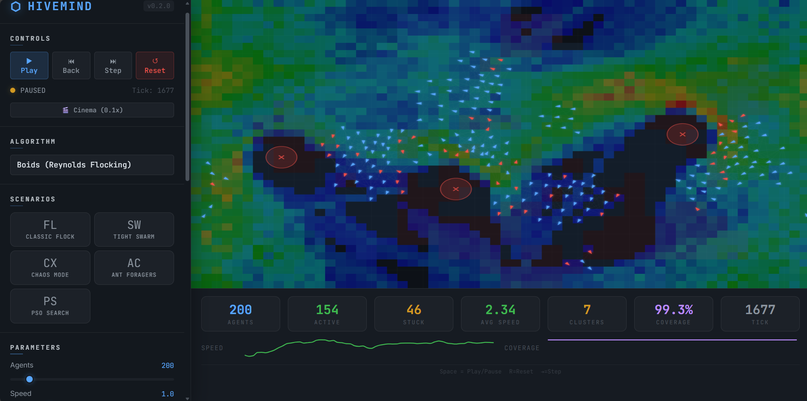
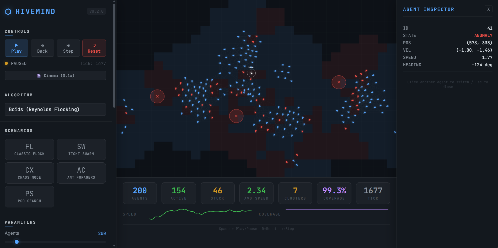

# HIVEMIND
### High-Performance Swarm Intelligence Debugger

**[Live Demo](https://hive-mind-psi.vercel.app/)** | **[Architecture Docs](docs/ARCHITECTURE.md)**

HIVEMIND is an advanced visual analytics platform for observing, debugging, and optimizing decentralized autonomous systems. Built on a custom high-performance physics engine, it allows researchers and developers to visualize emergent behaviors in real-time.

---

## Performance Architecture

HIVEMIND is engineered for high-count agent simulation without sacrificing UI responsiveness.

- **Non-blocking Simulation**: A dedicated Web Worker handles the $O(1)$ spatial hashing and per-agent physics, keeping the UI thread strictly for 60fps rendering.
- **Spatial Partitioning**: Agents are indexed using a high-density spatial hash grid, enabling real-time proximity queries for flocking, food foraging, and collision avoidance.
- **Time Mastery**: A 300-tick ring buffer enables **bidirectional time-traveling**. Step forward to predict convergence, or step backward to analyze the exact moment an anomaly occurred.

---

## Core Visualization Layers

### 1. Behavior Analysis
- **Force Vector Overlay**: Multi-colored tactical arrows visualize the specific pulls (cohesion, alignment, separation) acting on every agent.
- **Voronoi Partitioning**: Discrete real-time grid showing "territory" ownership and spatial dominance.
- **Heatmap Coverage**: Persistent trail analysis to identify gaps in swarm exploration.

### 2. Deep Inspection

- **Detailed Telemetry**: Click any agent to slide in an inspector panel showing velocity, heading, and algorithm-specific metadata.
- **Anomaly Detection**: Passive background detection identifies agents that are "stuck" or clustering pathologically, highlighting them in tactical red.

---

## Real-World Use Cases

HIVEMIND is designed to model several critical autonomous workflows:

- **Search & Rescue (PSO)**: Visualizing how a swarm of drones can collectively find a signal maximum (e.g., a heat source) in a complex environment.
- **Logistics & Foraging (ACO)**: Optimizing pathing between a base and multiple dynamic resource points using pheromone-based stigmergy.
- **Formation Control (Boids)**: Maintaining rigid or fluid formations through obstacle-heavy channels for coordinated movement.

---

## Future Roadmap (AEGIS Evolution)

HIVEMIND is the foundation for a broader suite of autonomous tools:

- **AEGIS Safety Auditor**: Integrating formal verification to guarantee agents stay within specific geofences.
- **Multi-Robot Communication Analysis**: Simulating packet loss and latency between agents to test swarm resilience.
- **Mission Planning Interop**: Direct export of optimized swarm paths to ROS2-compatible mission files.

---

## Development

### Local Setup
1. `npm install`
2. `npm run dev`

### Production Build
1. `npm run build`
2. `vercel deploy`

---
*Developed with ♥ by ThryLox*
